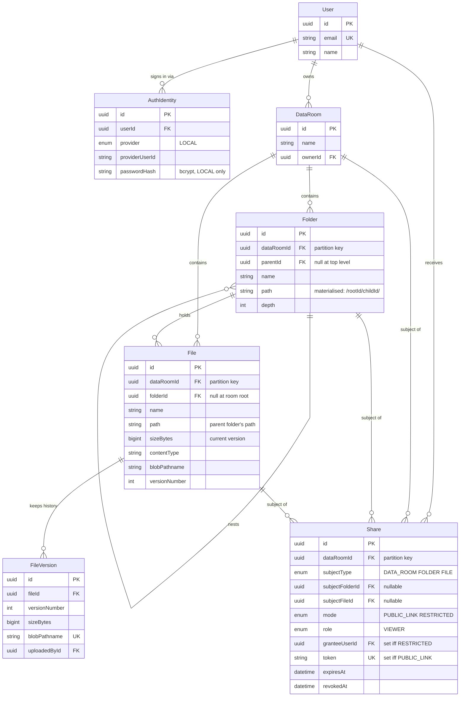

# Data Room

A secure repository for due-diligence documents. Folders nest, files upload
straight to blob storage, and any data room, folder or file can be shared
read-only — either with a named person or through an unguessable link.

| | |
| --- | --- |
| **Frontend** | https://test-task-web-khaki.vercel.app |
| **Backend** | https://test-task-api-tau.vercel.app |
| **Repository** | https://github.com/prtrymer/Test-Task |

The API reports its own configuration at
[`/health`](https://test-task-api-tau.vercel.app/health) — database
reachability, whether blob storage is configured, and which origins CORS
allows.

Stack: NestJS · Prisma · PostgreSQL · Vercel Blob · Next.js · TypeScript ·
Tailwind · shadcn/ui, deployed as two Vercel projects.

---

## Contents

- [Running it locally](#running-it-locally)
- [Architecture](#architecture)
- [Data model](#data-model)
- [Design decisions](#design-decisions)
- [How it scales](#how-it-scales)
- [Testing](#testing)
- [Where AI was used](#where-ai-was-used)
- [Known limitations](#known-limitations)

---

## Running it locally

**Prerequisites:** Node 20+, a PostgreSQL database, and a Vercel Blob store
created with **private** access. The access mode is fixed at creation and a
public store would make revoking a share meaningless, so this matters.

```bash
git clone https://github.com/prtrymer/Test-Task.git
cd Test-Task
npm install
cp .env.example .env
```

Fill in `.env`. Two entries deserve attention:

- `DATABASE_URL` is the **pooled** connection, used at runtime.
- `DIRECT_URL` is the **direct** connection, used only by the Prisma CLI.
  Migrations must bypass the pooler; pointing this at the pooled host fails in
  confusing ways.

On Prisma Postgres the two differ only by hostname — `pooled.db.prisma.io`
versus `db.prisma.io`.

```bash
npm run db:migrate    # apply the schema
npm run dev:api       # API → http://localhost:3001
npm run dev:web       # web → http://localhost:3000
```

The frontend reads `NEXT_PUBLIC_API_URL` from `apps/web/.env.local`.

Deployment is a separate runbook: [DEPLOYMENT.md](DEPLOYMENT.md).

---

## Architecture

The backend is hexagonal. Each module owns four layers, and dependencies only
ever point inwards:

```
apps/api/src/modules/<module>/
├── domain/           entities and rules — no imports from anywhere outward
├── application/      ports (interfaces) + command and query handlers
├── infrastructure/   adapters: Prisma, Vercel Blob, bcrypt, JWT
└── interface/http/   controllers, DTOs, presenters
```

Ports are abstract classes, so they serve as both the type and the DI token.
Swapping Vercel Blob for S3 is one line in `storage.module.ts`.

The practical payoff is testability: `AccessPolicy` decides who may see what
and is a pure function of `(user, target, shares, now)`, so the entire
permission matrix is tested without a database or an HTTP server.

**Writes and reads are split.** Commands go through the domain so invariants
hold. Queries have their own ports returning flat rows straight from SQL,
because rendering one page of a folder holding 100,000 files must not
reconstruct 100,000 aggregates.

The frontend is organised by feature — `browser`, `upload`, `sharing`,
`files`, `auth` — over a typed API client with TanStack Query for caching and
invalidation.

---

## Data model



Two ideas shape it.

**`dataRoomId` is the partition key.** Every content table carries it and every
composite index leads with it. No query spans data rooms.

**Folders and files carry a materialised `path`** of ancestor ids —
`/rootId/childId/`. Built from **ids, not names**, so renaming a folder never
rewrites anything; only moves do.

### Invariants the database enforces

Rules the schema language cannot express live in the migration, because an
invariant enforced by convention is an invariant waiting to be broken:

| Constraint | Why |
| --- | --- |
| Partial unique index on `(dataRoomId, name) WHERE parentId IS NULL` | Postgres treats NULLs as distinct, so the ordinary `UNIQUE(parentId, name)` silently permits two top-level folders with the same name |
| `CHECK` tying `subjectType` to the populated foreign key | A share cannot claim to point at a folder while carrying a file id |
| `CHECK` tying `mode` to its principal | A restricted share names a user; a public link carries a token. Never both, never neither |
| Partial unique indexes on active grants only | One live grant per person per subject, while still allowing revoke-then-reshare |
| `CHECK` on path shape and depth | The path is load-bearing for both subtree totals and permission checks |

---

## Design decisions

### The share subject uses three nullable foreign keys, not a polymorphic id

A share points at a data room, a folder, or a file. The tempting shape is
`(subjectType, subjectId)`, but a polymorphic id cannot carry a foreign key —
which means no cascade. Deleting a shared folder would silently strand its
shares, and the spec calls out exactly that scenario. Three nullable FKs plus a
`CHECK` are slightly less elegant to read and correct by construction.

### Bytes never pass through the API

Vercel functions cap request **and response** bodies at 4.5 MB — an
infrastructure limit, not a setting. So neither uploads nor downloads can be
proxied:

- **Upload** — the browser asks for a ticket, the API authorises and returns a
  presigned URL, the browser `PUT`s straight to storage, then calls back to
  commit the row. Progress comes from `XMLHttpRequest`, because `fetch` still
  has no upload progress event.
- **Download** — the API returns a short-lived signed URL and the browser
  fetches from the CDN.

Authorisation happens when the credential is minted, not when bytes move.

### The blob store is private, and read URLs are deliberately short-lived

Revocation cannot retract a signed URL already handed out, so the 5-minute TTL
*is* the exposure window. URLs are minted per view rather than cached, so a
revoked viewer is refused the moment they ask for a new one.

The store being private means this is enforced by the CDN, not by hoping nobody
guesses a path — fetching a blob without its signature returns **403**.

### Storage keys are opaque

A key is `{dataRoomId}/{uuid}.pdf` and never contains the filename. Vercel Blob
round-trips pathnames through its control API and returns non-ASCII mangled, so
a Cyrillic filename came back as mojibake and the signature scope check
rejected it — every such upload failed. Beyond that, signed URLs embed their
path, so the old scheme was publishing filenames that are frequently personal
data. The display name lives in the database, which is where it belongs.

### Denials are 404, never 403

Telling an unauthorised caller that an id exists is itself a disclosure and
lets them enumerate. Read denials answer "not found" whether the item is
missing or merely not theirs. The frontend's error state is written to cover
both, because the API deliberately does not distinguish.

### Uploads version; renames conflict

`UNIQUE(folderId, name)` makes "one logical file per name per folder" a
database guarantee. A same-name upload therefore appends a `FileVersion`
instead of failing or overwriting. A rename cannot resolve that way — the two
files have separate histories — so it surfaces a conflict.

### Deletes are hard, and cascade in the database

`ON DELETE CASCADE` runs folder → subfolder → file → version → share in one
transaction, so orphans are impossible rather than merely unlikely. Blobs are
removed afterwards: an orphaned blob costs storage, whereas the reverse order
would leave rows pointing at objects that no longer exist.

Before deleting a folder the UI asks the server what would go with it and shows
the count and total size, so it is never a blind action.

### The share token travels in a header

It is the only thing protecting a public link's contents, and query strings
leak into access logs, browser history and `Referer`. The token lives in the
frontend's own URL and reaches the API as `X-Share-Token`.

### Serverless NestJS is pre-compiled

Vercel bundles function sources with esbuild, which does not emit the
`design:paramtypes` metadata Nest's DI reads — bundling the decorated source
builds cleanly and then fails to resolve any provider at runtime. `tsc`
compiles ahead of time and the function is a thin shim over `dist/`. The
bootstrapped app is cached in module scope: measured locally, **781 ms cold,
3 ms warm**.

---

## How it scales

### Computing a folder's total size and item count, including the whole subtree

One indexed prefix scan. Because every folder and file stores a materialised
path, the subtree of folder `X` is exactly the rows whose path begins with
`X.path`:

```sql
SELECT count(*)::int, coalesce(sum("sizeBytes"), 0)::bigint
FROM   "files"
WHERE  "dataRoomId" = $1 AND "path" LIKE $2;   -- $2 = '/rootId/xId/%'
```

No recursive CTE, no tree walk, no per-node round trip. The
`(dataRoomId, path text_pattern_ops)` index makes it a range scan — `EXPLAIN`
confirms Postgres rewrites the `LIKE` into bounded `~>=~` / `~<~` comparisons:

```
Index Only Scan using "files_dataRoomId_path_idx" on files
  Index Cond: ("dataRoomId" = … AND path ~>=~ '/e4426b4a…/' AND path ~<~ '/e4426b4a…0')
```

The trailing slash on every path is what makes this safe: without it `/ab/`
would appear to sit beneath `/a/`, leaking a sibling folder through a share.

Totals are computed live rather than cached. At this size the query is already
fast, and a denormalised counter is a correctness liability the moment a write
path forgets to update it. If measurement ever demanded it, the upgrade is a
`sizeBytes`/`itemCount` column on `Folder` maintained in the same transaction
as the write — the read path would not change shape.

### What changes when one data room holds 100,000 files

Less than it sounds. 100,000 rows is small for Postgres; the changes are about
access patterns, not architecture.

**Listing** is already a single-table index scan. Folder listings read
`(dataRoomId, folderId, name)` directly, without joining `FileVersion`, because
the current version's size, type and blob key are denormalised onto `File`.
That denormalisation exists precisely for this case.

**Pagination is keyset, not `OFFSET`.** `OFFSET 90000` makes Postgres walk and
discard 90,000 rows; the cost grows linearly with depth into the listing.
Instead the cursor carries the last row's sort key and id:

```sql
WHERE (sort_group, sort_key, id) > ($cursor_group, $cursor_key, $cursor_id)
ORDER BY sort_group, sort_key, id
LIMIT $n
```

Constant cost per page regardless of depth. The cursor is opaque base64 and a
malformed one restarts the listing rather than failing the request.

**Indexes** are all composite and lead with the partition key:

| Index | Serves |
| --- | --- |
| `(dataRoomId, folderId, name)` | folder listing, sorted |
| `(dataRoomId, path text_pattern_ops)` | subtree totals, subtree listing, share coverage |
| `(dataRoomId, updatedAt DESC)` | recency sort |
| `GIN (name gin_trgm_ops)` | substring filename search |

Search needs the trigram index specifically: a B-tree cannot serve a leading
wildcard, so `ILIKE '%term%'` would be a sequential scan without it.

**Beyond one instance**, `dataRoomId` is already the shard key. No query
crosses data rooms, so splitting on `hash(dataRoomId)` requires no remodelling.
That work is deliberately not done — sharding at 100,000 rows would trade
working foreign keys and transactions for a problem Postgres does not have yet.

### Extending sharing to per-user roles without remodelling

The grant is already `(subject, principal, role)`. `role` is an enum that today
holds one value:

```prisma
enum ShareRole {
  VIEWER
}
```

Adding `EDITOR` is `ALTER TYPE … ADD VALUE` plus one line in `AccessPolicy`:

```ts
canWrite: covering.role === 'EDITOR',
```

No relationship changes, no new tables, no migration of existing rows — they
keep the default. This works because permission decisions were centralised
from the start: `AccessPolicy.evaluate` is the only place that answers "may
they?", and every read and write path routes through `AccessResolver`. Roles
scoped to groups or teams would slot in the same way, by adding a principal
kind alongside `granteeUserId` rather than by changing what a share *is*.

---

## Testing

```bash
npm test    # 42 unit tests
```

**Unit tests** cover the domain with no database or HTTP: the materialised-path
prefix-collision case, folder-move cycle rejection, and the full permission
matrix including expiry, revocation and cross-room isolation.

**Integration tests** run against a live API, real Postgres and real Vercel
Blob — 48 assertions covering registration, name conflicts, subtree cascade,
public links, revocation, and non-ASCII filenames end to end. Both were run
against the deployed environment, not only locally.

---

## Where AI was used

I used Claude (via Claude Code) throughout, and it wrote the majority of the
implementation code. The split was roughly:

**Mine.** The architectural direction — hexagonal layering, the CQRS read/write
split, the decision to keep the system shard-*ready* rather than sharded, and
the requirement to treat entity relationships and cascade behaviour as
first-class. I reviewed and edited the schema before anything was built on it,
chose the deployment topology, and made the calls on scope, including dropping
Google OAuth.

**AI-assisted.** Research into platform constraints that shaped the design — the 4.5 MB function body cap that
forced direct-to-blob transfer, and Vercel Blob's private-store and signed-URL
behaviour.

**Where it earned its keep.** Several defects were caught by insisting on
end-to-end verification against real infrastructure rather than trusting that
code which compiles works:

- Non-ASCII filenames failed every upload, because Vercel Blob mangles
  pathnames through its control API. Found by testing Cyrillic, CJK, RTL and
  emoji names — not by reading the code.
- The public-link path returned 400 for every anonymous request; the global
  validation pipe rejected the token as an undeclared query parameter.
- The account menu crashed the entire page: a Base UI group-scoped part was
  rendered outside a group.
- Uploads silently failed to commit, because the blob store appends a random
  suffix to keys.

---

## Known limitations

Honest about what is not there:

- **No Google OAuth.** Email and password only. `AuthIdentity` is a separate
  table specifically so a second provider is a row rather than a migration, but
  the provider itself is not implemented.
- **Version history is stored, not browsable.** Superseded versions and their
  blobs are retained and a `v2` badge appears in the list view, but there is no
  UI to view or restore an earlier version.
- **No trash or undo.** Deletes are immediate and permanent, which the
  confirmation dialog states plainly.
- **Search matches filenames only**, not document contents.
- **`bcryptjs` at 12 rounds costs ~2 s per login** on a serverless CPU. A
  native binding is faster but a compiled dependency is a deployment hazard on
  Vercel; lowering the cost factor is the better trade if it matters.
- **The grid view omits the version badge** that the list view shows.
